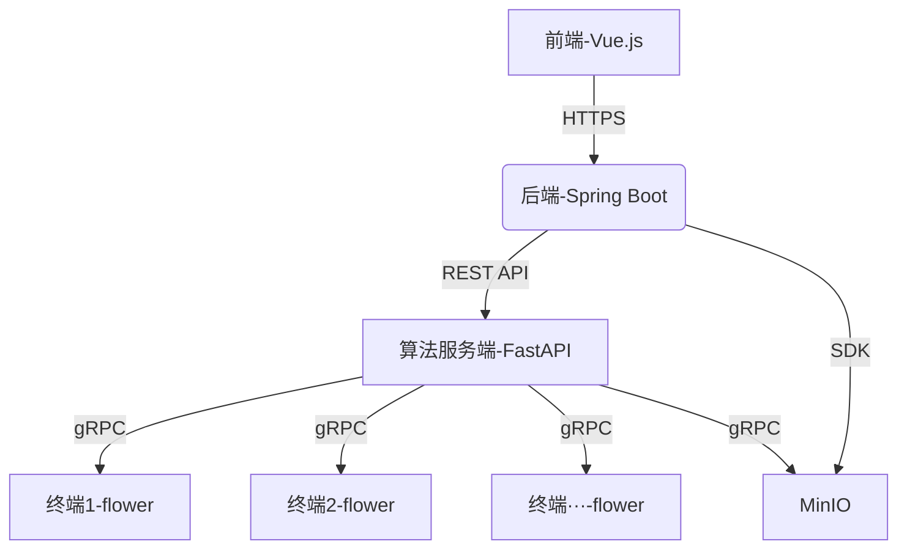

---

## **面向数据流处理的隐私计算平台（基于组织细胞癌症识别的联邦学习平台）需求分析**

---

### **一、项目背景**
为提升医疗数据隐私保护下的癌症识别效率，本项目拟搭建一个基于联邦学习的分布式平台，允许多个医疗机构在不共享原始数据的前提下协作训练深度学习模型，用于组织细胞病理图像的癌症识别。平台需支持数据可视化,模型训练参数选择,联邦学习配置选择,训练过程可视化,模型参数评估。

---

### **二、用户角色与功能需求**

#### **1. 医疗机构用户（客户端）**
**功能需求**：
  - 数据上传：上传本地的组织细胞病理图像（支持PNG/JPG/DICOM格式）。
  - 配置文件修改:修改配置文件里面的配置
  - 任务参与：加入联邦学习任务，启动本地模型训练。
  - 训练监控：查看本地训练进度、损失曲线、资源占用（CPU/GPU）。
  - 结果下载：获取最终全局模型文件（.pt或.h5格式）。


**客户端前端**：
1. 上传病人图片
   
   - 拖拽就能上传显微镜拍的细胞图片

   - 支持常见图片格式（JPG/PNG）

   - 专门支持医疗用的DICOM格式

   - 传错了会立即提醒（比如"这张图格式不对"）

2.  查看训练情况 

本地训练时会显示：

   - 学习曲线（训练提升过程）

   - 电脑资源使用

   - 实时日志（例如："第2轮训练完成，准确率提升2%"）
     
3. 下载最终模型

   - 训练结束后可以下载训练好的AI模型

   - 拿到一个.pt或.h5文件

   - 附带简单使用说明

   - 可以查看历史版本


#### **2. 计算平台使用者/研究人员（服务端前端[隐私计算的发起者]）**
**功能需求**：
 1. 创建训练任务
   
   - 基础设置：要训练多少轮（比如设10轮）、每轮练多少次（比如每轮练3遍）

   - 医院参与：总共多少家医院参加（比如20家）、最少需要多少家才能开始（比如至少5家）

   - 网络设置：服务器的地址（比如127.0.0.1:80）

     设好后点"开始训练"按钮，就能够进行训练了

2. 监控训练过程
3. 实施训练可视化：
   
   - 折线图显示AI认图的准确率变化（从60%慢慢升到85%这样的过程）

   - 矩阵图显示AI认错的情况（比如把A型癌看成B型的次数）

   - 仪表盘显示各家医院的电脑运行情况（CPU/GPU使用率）

4. 分析最终结果

训练结束后生成详细报告：

   - 最终准确率（比如85.7%）

   - 错认统计（哪种癌症最容易认错）

#### **3.(服务器后端）**
**功能需求**：
1. 任务管理

   - 创建任务：接收前端请求，生成唯一任务ID，调用Python服务端初始化模型，保存任务状态至内存。

   - 任务列表查询：返回所有任务的简略信息（ID、名称、状态）。

   - 任务详情查询：返回单个任务的详细进度、准确率、创建时间。

2. 传递联邦学习过程结果给前端

   - 进度更新：定期轮询Python服务端的日志，更新任务进度与准确率。
   
   - 传递结果：JSON 格式传递（训练总轮次，总时间，总损失率，总准确率）


核心接口

接口	方法	说明
POST /tasks	POST	创建任务，返回成功信息。
GET /result	GET	获取所有任务详情（含进度、损失率、准确率）。


### **三、系统模块需求**

#### **1. 联邦学习核心模块**
- **客户端（Python）**：
  - 本地模型初始化：从服务端下载初始模型权重。
  - 隐私保护训练：基于本地数据训练模型，生成加密梯度参数。
  - 梯度上传：通过gRPC将梯度上传至服务端。
  - 日志输出：记录训练指标（损失、准确率）至结构化日志文件。
  - 本地AI部署：提供问答服务。

- **服务端（Python + FastAPI）**：
  - 任务调度：分配任务ID，协调多客户端训练节奏。
  - 梯度聚合：实现FedAvg/FedProx等算法，生成全局模型。
  - 模型分发：将更新后的模型推送至各客户端。

#### **2. 业务后端（Java Spring Boot）**
- **核心功能**：
  - 日志收集：监听客户端日志文件，解析为JSON格式。
  - API网关：为前端提供RESTful接口，创建联邦学习任务。
  - 用户认证：JWT令牌签发与验证，角色权限拦截。（以后拓展）
  - 数据代理：接收前端上传的病理图像，转存至MinIO对象存储。（以后拓展）

- **关键接口**：
  ```text
  POST /api/tasks          # 创建联邦学习任务
  GET /api/result          # 获取最终结果
  ```

#### **3. 前端（Vue.js）**
- **核心页面**：
  - **仪表盘**：全局任务状态地图（显示参与机构位置）、资源占用监控。
  - **任务管理**：任务列表、进度条、实时日志滚动展示。
  - **数据看板**：模型准确率趋势图、混淆矩阵、ROC曲线。
  - **图像上传**：拖拽上传界面，支持批量上传与格式校验。
 
    
**具体页面设计**：
1. 登录页面
   
   - 医生和研究专家用不同账号登录

2. 仪表盘首页
   
   - 地图显示哪些医院在参与
          
   - 重要通知栏（比如"明天系统升级"）

3. 训练监控页
   
同时显示多种信息：

   - 主屏幕：准确率变化曲线（走势图）

   - 右下角：资源使用

   - 侧边栏：实时日志


- **技术需求**：
  - 响应式布局：适配PC、平板及大屏显示器。
  - 可视化库：集成ECharts展示训练指标。
 
    
  **可视化库的分工**：
   - ECharts：做标准的曲线图、柱状图
   - Chart.js：做简单的小图表

---

### **四、非功能性需求**

#### **1. 性能需求**（当前阶段是多线程模拟，以后具体实现）
- 并发支持：至少50个客户端同时参与联邦学习任务。
- 响应时间：  
  - 前端页面加载：< 2s（静态资源CDN加速）。  
  - 单张图像预测：< 3s（GPU加速推理）。

#### **2. 安全需求**（联邦学习本身具备一定的安全性，需要时再拓展）
- 数据加密：客户端梯度传输使用AES-256加密。
- 隐私保护：使用差分隐私（DP）。
- 访问控制：RBAC权限模型，医生仅可访问所属机构数据。

#### **3. 可靠性需求**（需启用数据库，以后拓展）
- 服务容错：客户端断线后自动重试，服务端模型版本回滚机制。
- 日志追踪：保留6个月操作日志，支持溯源审计。

#### **4. 可扩展性**（正在实现）
- 模块化设计：可快速替换聚合算法（如切换FedAvg至FedBN）。
- 横向扩展：支持动态添加客户端节点，无需重启服务。

---

### **五、系统架构图**


---

### **六、数据流说明**
1. **联邦训练流程**：
   - 管理员创建任务 → 服务端初始化模型 → 客户端下载模型 → 本地训练 → 梯度上传 → 服务端聚合 → 更新全局模型并传递给后端（循环至收敛）。
2. **数据呈现流程**
   - 后端轮询获取服务端数据→  → 前端获取后端数据 → 前端展示最终可视化页面。
3. **癌症识别流程**：（以后拓展）
   - 医生上传图像 → 后端调用全局模型 → 返回预测结果 → 前端渲染热力图。

---

### **七、验收标准**
1. **功能验收**：
   - 成功完成5家模拟机构的联邦训练任务，全局模型准确率 > 85%。
   - 支持1000张以上病理图像的并发预测，无服务崩溃。

2. **性能验收**：
   - 客户端梯度上传延迟 < 1s（局域网环境）。
   - 日志从生成到前端展示延迟 < 5s。

3. **安全验收**：
   - 通过OWASP ZAP扫描，无高危漏洞。
   - 客户端数据包捕获测试显示梯度为密文。

---

### **八、依赖与约束**
- **硬件依赖**：服务端需GPU（NVIDIA Tesla T4以上）加速聚合计算。（用云服务器）
- **法律约束**：病理数据需脱敏处理，符合《医疗数据隐私保护条例》。


### **九、潜在问题与解决方案**
1. 医生不会操作？
   
   - 内置引导视频

2. 数据量大卡顿？
   
   - 分级加载（先看缩略图，点开再加载高清图）
     
   - 后台预处理（像相册生成小图预览）


---
